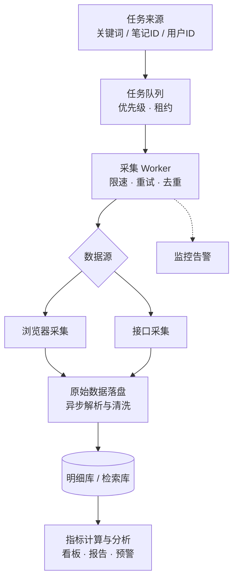

# 小红书爬虫方案

### 小红书数据采集 · 工程化实践 · 数据分析

 

面向长期稳定运行的小红书数据采集与分析工程方案：从调度、限速、去重、存储，到指标体系与分析应用。

任务调度 · 限速重试 · 去重增量 · 分层存储 · 指标体系 · 数据分析

   

[能采集什么](#data) · [工程问题](#challenges) · [整体架构](#architecture) · [模块设计](#modules) · [数据分析](#analysis) · [数据服务](#galaxy-api) · [合规须知](#compliance) · [交流合作](#contact)

## 一、能采集哪些数据

| 数据类型 | 典型字段 | 常见用途 |
|---|---|---|
| 笔记详情 | 标题、正文、图片 / 视频、话题标签、互动数据 | 内容分析、爆款研究 |
| 评论 | 一级评论、二级回复、点赞数 | 舆情监测、用户反馈挖掘 |
| 搜索结果 | 关键词下的笔记 / 用户列表、联想词 | 关键词监测、选题调研 |
| 用户主页 | 公开资料、作品列表、粉丝数 | 达人筛选、竞品账号追踪 |
| 话题与商品 | 话题笔记流、商品信息与评价 | 品类分析、电商调研 |
| 蒲公英达人数据 | 达人列表、数据表现、粉丝画像 | 投放选号、KOL 评估 |

> 以上均指小红书上**公开可见**的数据。涉及个人信息的内容请依法处理，详见 [合规须知](#compliance)。

## 二、工程上要解决的问题

| 问题 | 表现 | 工程对策 |
|---|---|---|
| 登录态失效 | Cookie 过期后请求大面积失败 | 登录态集中管理，失效自动检测并告警，受影响任务回到队列 |
| 请求参数变化 | 小红书版本更新后请求被拒、签名校验失败 | 采集层与业务层解耦，数据源独立成可替换模块，更新时只改一处 |
| 频率限制 | 请求过快触发限制或验证 | 全局与分接口两级限速，按任务优先级分配请求配额 |
| 字段变化 | 解析报错、字段缺失 | 原始响应先落盘再异步解析，解析失败可重放 |
| 规模化 | 任务量大、失败多、难以追踪 | 任务队列 + 多 Worker，失败重试与死信队列，全链路监控 |

## 三、整体架构

核心思路是**分层解耦**：调度、采集、解析、存储各自独立，数据源可以独立替换或并行使用，而不影响上下游。

## 四、关键模块设计

### 4.1 任务调度

- **任务模型**：`任务ID`、`类型`（笔记详情 / 评论 / 搜索 / 用户主页）、`目标ID`、`优先级`、`状态`、`重试次数`、`下次执行时间`。
- **队列选型**：规模不大时用数据库任务表即可（配合行锁领取任务）；并发较高时用 Redis 或 RabbitMQ。
- **租约机制**：Worker 领取任务时写入租约到期时间，进程崩溃后任务自动回收，避免丢任务或重复执行。
- **优先级**：实时监测类任务优先于历史回溯类任务，保证关键数据的时效。

### 4.2 限速与重试

| 错误类型 | 是否重试 | 处理策略 |
|---|:---:|---|
| 参数错误 | 否 | 标记失败，记录原因，人工排查 |
| 鉴权失败 | 否 | 暂停该数据源并告警 |
| 超时、5xx、服务繁忙 | 是 | 指数退避 + 随机抖动，超过上限进入死信队列 |

- 使用**令牌桶**做全局限速，再按接口单独限速，避免某类任务挤占全部配额。
- 请求超时要留足余量（如 **60 秒**），慢响应不等于失败，避免过早判定超时造成重复请求。

### 4.3 去重与增量

- **幂等写入**：以笔记 ID、评论 ID、用户 ID 作为唯一键，重复采集只更新不新增。
- **增量游标**：评论、作品列表等分页数据记录游标与最新时间，只拉取新增部分。
- **定期刷新**：点赞、收藏、评论数等互动数据按热度分级刷新，热门内容刷新更频繁。

### 4.4 分层存储

| 层级 | 存储 | 用途 |
|---|---|---|
| 原始层 | 对象存储 / JSON 文件 | 保存接口原始响应，便于重放与追溯 |
| 明细层 | MySQL / PostgreSQL | 结构化的笔记、评论、用户表，供业务查询 |
| 检索层 | Elasticsearch | 全文检索、关键词聚合与舆情分析 |
| 分析层 | ClickHouse / Doris | 大规模聚合与指标计算，支撑看板和报表 |

### 4.5 监控告警

- **核心指标**：请求成功率、P95 耗时、各错误类型占比、队列积压量、数据新鲜度。
- **告警规则**：成功率骤降、积压持续增长、鉴权失败出现时立即通知。
- **可追溯**：每次请求记录任务 ID、耗时与结果，便于定位问题。

## 五、数据分析

采集只是起点，数据的价值体现在分析层。建议按「清洗建模 → 指标体系 → 分析场景 → 输出应用」四步搭建。

### 5.1 清洗与建模

- **统一口径**：时间统一时区；「1.2万」「10w+」这类展示值转换为数值；剔除重复与已删除内容。
- **快照表**：点赞、收藏、评论数会持续变化，按采集时间保存快照，才能计算增速和内容生命周期。
- **维度表**：笔记、作者、话题、品牌 / 品类分表存储，笔记与话题、品牌之间建立多对多关联。
- **文本预处理**：分词、去停用词，抽取话题标签、表情与品牌词，为文本分析做准备。

### 5.2 核心指标

| 指标 | 计算方式 | 用途 |
|---|---|---|
| 互动量 | 点赞 + 收藏 + 评论 + 分享 | 衡量单篇内容热度 |
| 赞藏比 | 收藏 ÷ 点赞 | 收藏占比高，通常说明内容实用、干货属性强 |
| 互动增速 | 相邻两次快照的互动量差 ÷ 时间间隔 | 识别正在起量的内容 |
| 粉丝互动率 | 近 N 篇平均互动量 ÷ 粉丝数 | 评估达人真实影响力，识别粉丝虚高 |
| 声量占比（SOV） | 品牌相关笔记数或互动量 ÷ 品类总量 | 竞品对比、投放效果评估 |
| 负面率 | 负面评论数 ÷ 评论总数 | 口碑监测与舆情预警 |

### 5.3 常见分析场景

- **爆款内容分析**：按品类取互动量前 5% 作为爆款样本，对比标题、封面类型、发布时间与话题标签，提炼可复用的内容模式。
- **关键词与趋势**：追踪关键词、话题的笔记量与互动量随时间的变化，发现上升趋势和季节性规律。
- **评论洞察**：对评论做情感分类与主题聚类，提取用户痛点、购买顾虑和真实需求。
- **达人评估**：综合粉丝互动率、内容垂直度、更新频率、商业笔记表现与粉丝画像，筛选合适的合作对象。
- **竞品监测**：持续跟踪竞品的声量、互动与内容策略，及时发现新品上市和营销动作。

### 5.4 工具与输出

| 环节 | 常用工具 / 形式 |
|---|---|
| 文本分析 | jieba 分词、情感分类模型、大语言模型（摘要、打标签、主题归纳） |
| 可视化 | Superset / Metabase / Grafana |
| 输出形式 | 数据看板、定时日报 / 周报、异常波动预警推送 |

## 六、数据服务

为了方便大家使用，我们也提供现成的小红书数据服务 **Galaxy API**。上文架构中的数据源层可以直接接入它，省去登录态、请求参数与风控的维护，把精力放在调度、存储和分析上。

[注册 / 获取 API Key](https://galaxysapi.com/login?utm_source=github&utm_medium=readme&utm_campaign=xhs-data-engineering) · [在线文档](https://api.galaxysapi.com/doc/) · [Telegram 咨询](https://t.me/luckfezx)

- **免维护**：无需账号、Cookie、代理，签名与风控由服务端处理
- **仅成功扣费**：请求失败、异常均不扣费，按次计费
- **标准 HTTP 接口**：任何语言直接调用，返回 JSON，文档支持在线测试
- **三步接入**：[注册获取 API Key](https://galaxysapi.com/docs/apikey?utm_source=github&utm_medium=readme&utm_campaign=xhs-data-engineering) → 请求头携带 `Authorization: YOUR_API_KEY` → 调用接口

## 七、合规须知

- 只采集小红书上**公开可见**的数据，遵守《个人信息保护法》《数据安全法》《网络安全法》等法律法规，以及小红书的用户协议。
- 合理控制采集频率，不对小红书的正常服务造成影响。
- 涉及个人信息的数据依法处理、最小化使用；数据用于自身业务分析，不转售、不公开分发。
- 本文仅作技术交流与学习参考，请在合法合规的前提下使用。

## 交流与合作

数据采集方案咨询、技术交流与合作：Telegram [@luckfezx](https://t.me/luckfezx) · [galaxysapi.com](https://galaxysapi.com/?utm_source=github&utm_medium=readme&utm_campaign=xhs-data-engineering)

## 许可证

本项目基于 [MIT](./LICENSE) 许可证开源。

---

最后更新：2026-10-07
